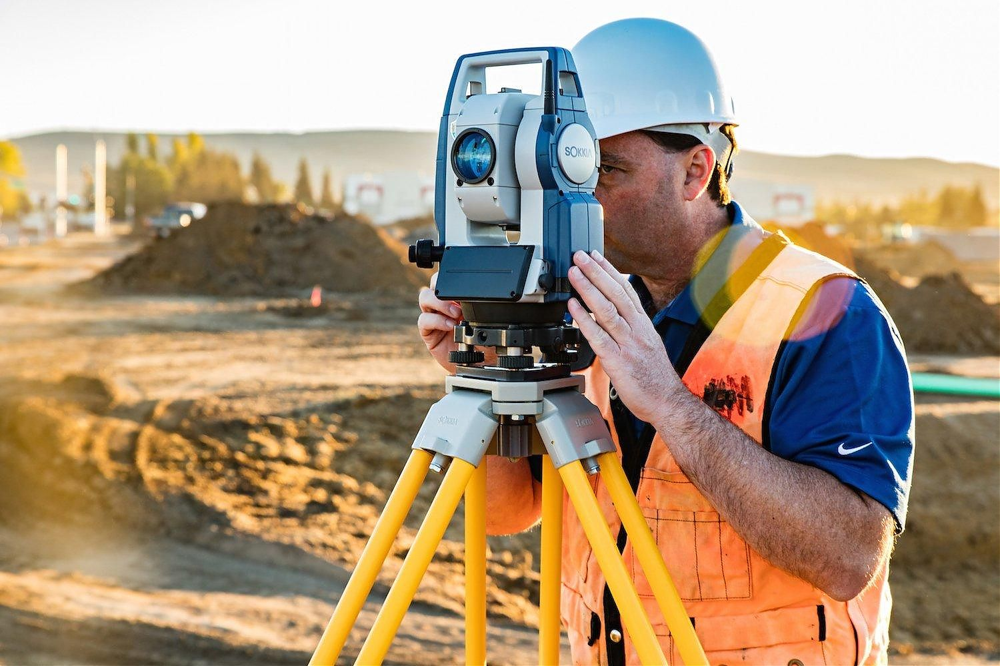
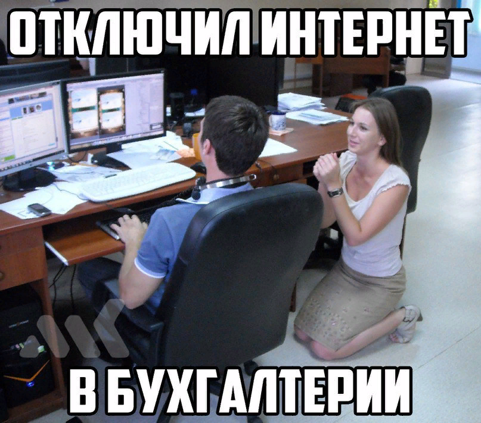

# <ins> Мой путь</ins> 
  
||  
V  

  
Меня зовут ***Алексей*** и я хочу поведать вам о причинах и цели моего начала обучения программированию.  

Я закончил <ins> Московский Государственный Университет Геодезии и Картографии.</ins>  
Моя специальность **Инженер Геодезист**.  
Моя профессия заключается в сопровождении строительства различного рода объектов, а именно отрисовке исполнительных чертежей и работе с приборами:  
- *Тахеометрами*  
- *GPS приемниками*.  

Я отработал по профилю 3.5 года и сделал для себя выводы.

# Причины  

1. Я для себя понял, что мне не приносит удовольствия решать одни и те же задачи 24/7, а моя работа именно в этом и заключается.
2. Уровень знаний не ценится и от него мало что зависит. (Пример: ты нашел новый, более быстрый способ решения определенный задачи. Всем все равно.)
3. Нет дальнейшего роста 
4. Нет удовольствия от работы, а я считаю если дело которым ты занимаешься не приносит удовольствия нужно бежать.  

# Цель

Мне всегда нравилось иметь дело с компьютерами и решать _отличающиеся друг от друга_ задачи которые с ними связаны приносило некую радость.
Именно по этой причине я все же выбрал для себя программирование, так как считаю, что знания программирования на каком либо языке поможет мне не только работать в этой сфере, но еще и создать что-то *СВОЕ*.
